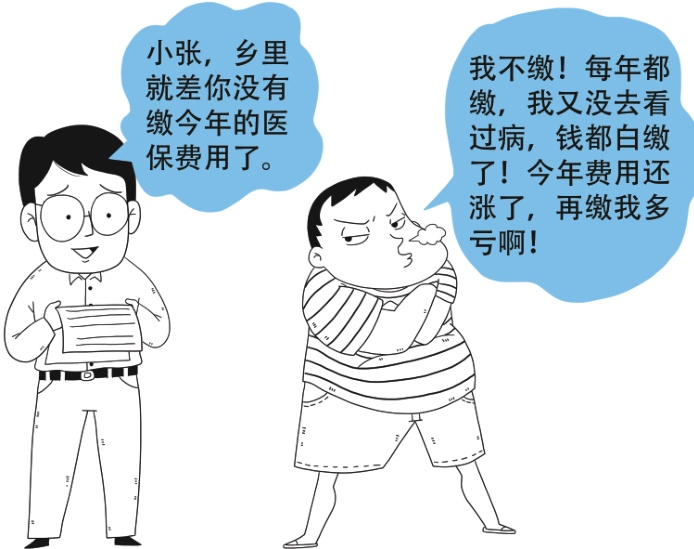

## I 参保缴费

## 🍹问题一

问.富裕乡负责社保费用征收的公务员，近期天天催乡里的小张缴纳居民医保费用。小张表示：自己收入比较少，以前每年都缴纳医保费用，2017年自己缴了190元，2018年缴了220元；听说2019年费用又涨到250元。但自己从来没看过病，感觉钱都白缴了，所以不愿意缴费。小张的想法对吗？

> 📌 图片内容识别：
>
> 小张，乡里就差你没有缴今年的医保费用了。
>
> 我不缴！每年都缴，我又没去看过病，钱都白缴了！今年费用还涨了，再缴我多亏啊！

防范化解医疗费用风险的。基本原则是互助共济，健康的人帮助