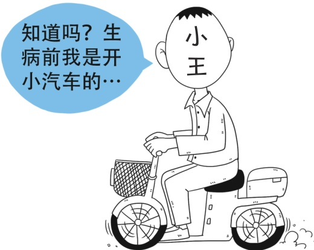

生病的人，大家每人都拿出一小部分钱放到一起，汇成一个大的基金池，给有需要的人用，也就是“我为人人，人人为我”。小张以前没用到医保，不代表以后都用不到，等到小张生病需要用钱的时候也可以获得医保的保障，用的就是这个基金池中大家一起出的钱。比如邻村的小王拒绝参加医保，去年得了癌症，结果全部自费，四处借钱，掏了20多万元，事后算算如果参加医保，可能自己只需要掏几万元，后悔得不得了。所以小张参加医保绝对不亏。

> 📌 图片内容识别：
>
> 知道吗？生病前我是开小汽车的…

另外，小张参加的是城乡居民医保，实行政府补贴和个人缴费相结合的筹资机制。与个人缴费相比，在整个居民医保的筹资结构中，财政补贴占了大头。2017年国家对每位参保人补贴了450元，2018年国家对每位参保人补贴了490元，2019年国家对每位参保人补贴了520元。所以小张2019年参加居民医保虽然个人缴费为250元，但最终的医保参保费用至少有770元，可以说个人实际只缴纳了较小的比例，国家在帮助居民参保方面投入更大。

