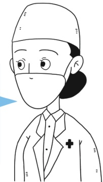

答.2015年6月，国家改革药品价格形成机制，除少数特殊管制药品外，绝大部分药品价格实行市场调节，由经营者自主确定价格。影响药品实际交易价格的因素很多，公立医院和民营医院采购渠道不同，成本费用构成存在差异是客观现象，患者完全可以根据自身实际情况选择个人负担低的渠道购买药品。

例如，2018年下半年，国家在“4+7”城市（北京、上海、天津、重庆、沈阳、大连、厦门、广州、深圳、西安、成都）的公立医院开展国家组织药品集中采购和使用试点，试点的25个中选药品平均降价幅度达到52%。2019年9月，试点范围扩大到了全国，这些药品在全国公立医院的价格会明显低于民营医院。

##  问题十

费用该如何进行报销？

> 📌 图片内容识别：
>
> 

大夫我今天要看病，但是我的社保卡丢了，要怎么报销啊？

放心，医保是可以给您先行垫付的，后续您持相关材料进行手工报销即可。

> 📌 图片内容识别：
>
> 

