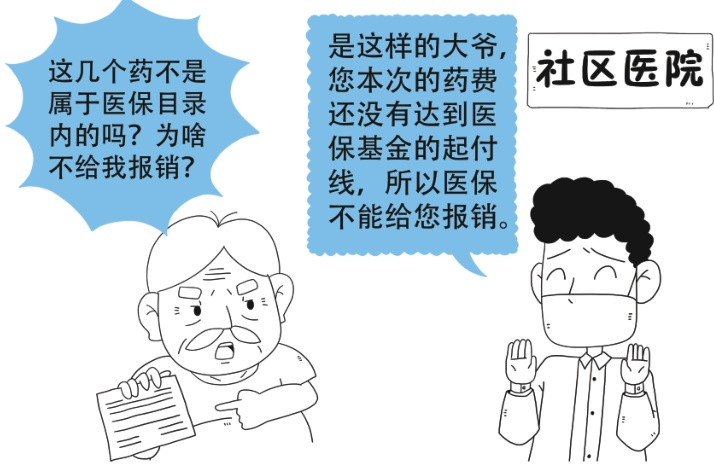

答口.参保人员在门、急诊就医时应刷卡结算。在新参保未发卡、急诊未持卡、社会保障卡丢失、异地突发急诊、社保卡挂失、异地就医未能直接结算等情况时，参保患者可先行垫付，后需持相关材料进行手工报销。

需手工报销垫付的医疗费用时，参保人员一般应提供加盖地市级以上财政/税务监制章的费用收据联、与收据相对应的明细清单；除此之外，门诊就医的还需提供与收据相对应的处方底联、急诊诊断证明，住院就医的还需提供出院记录、诊断证明等。具体情况按照各参保地政策执行。

## 问题十一

目录内的药，但是都没有报销，赵大爷很不解，这是为什么？

> 📌 图片内容识别：
>
> 这几个药不是属于医保目录内的吗？为啥不给我报销？
>
> 是这样的大爷，您本次的药费还没有达到医保基金的起付线，所以医保不能给您报销。社区医院

