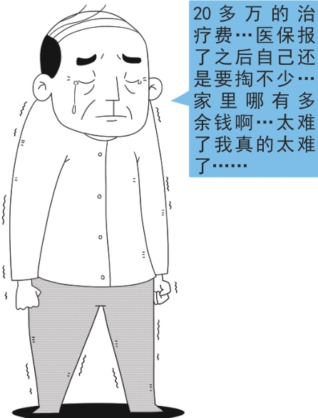

> 📌 图片内容识别：
>
> 

>
>
> 20 多万的治疗费…医保报了 之 后 自 己还是要掏不少…家里哪有多余钱啊…太难了我真的太难了……

的个人负担部分，可根据实际医疗费用负担情况，纳入城乡居民大病保险范围。大病保险是基本医疗保障制度的拓展和延伸，主要对大病患者高额医疗费用在基本医保支付基础上再给予进一步支付。对参保居民经基本医保支付后，超出大病保险起付线的费用，按规定纳入大病保险支付范围。

目前来看，大病保险政策范围内费用支付比例达到50%以上，并且保障水平在进一步提升，2019年《政府工作报告》明确“降低并统一大病保险起付线”“报销比例由50%提高到60%”。2019年4月国家医保局联合财政部印发《关于做好2019年城乡居民基本医疗保障工作的通知》，也明确起付线降低至上一年度居民人均可支配收入的50%，同时要求进一步加大对贫困