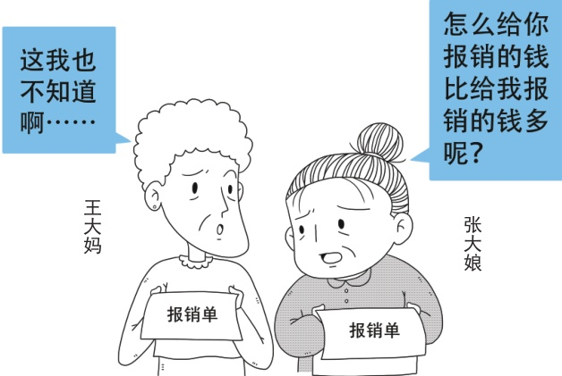

## 问题十三

问13.富裕乡的张大娘参加的是城乡居民医保，县城的王大妈参加的是职工医保，两个人年龄相同，参保的医保类型不同。两人一起去医院开了同样的感冒药，可报销的费用不同，这是什么原因呢？

> 📌 图片内容识别：
>
> 怎么给你报销的钱比给我报销的钱多呢？
>
>
>
> 

>
>
> 张大娘

是职工基本医疗保险，两个人参加的是不同类型的医保。由于职工基本医疗保险与城乡居民医疗保险这两个险种在参保和筹资上有差别，职工医疗保险年均缴费要几千元，居民医疗保险年人均缴费只有几百元，与缴费相对应的待遇也有差别，所以报销的费用也不同。

