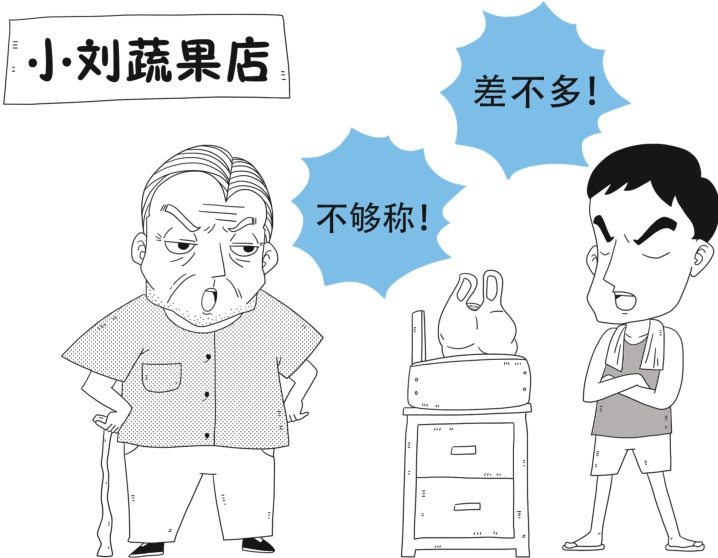

## 问题十四

问Ⅰ4.退休的老王在市场买菜时与卖菜青年小刘发生口角，最终两人扭打在一起，导致老王右手脱臼，小刘头部血肿。经众人调解后，两人同赴定点医疗机构外科治疗。接诊医生看了两人伤情并了解事由后，却说他俩治疗的医疗费用不能报销。老王参加的是职工医疗保险，目前应享受退休职工医疗费用报销待遇，卖菜青年小刘参加的是城乡居民保险也能享受相应的医疗费用报销，为什么医生说他俩治疗的医疗费用不能报销？

> 📌 图片内容识别：
>
> # 11:小刘蔬果店11
>
> 差不多！
>
> 不够称！

