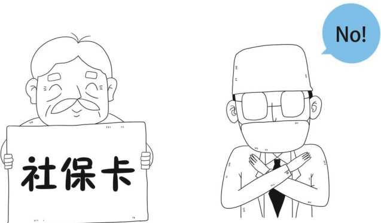

> 📌 图片内容识别：
>
> 

>
>
> 

三十条的规定，交通事故等存在第三方责任人的情况，应由第三方责任人承担医疗费用，医保不能予以报销。也就是说，赵大爷这种情况应该由肇事者承担医疗费用，医保不能报销。

此外，如果赵大爷自行到医院就医时，不对医生说明受伤的真实原因，而是让医生按照自己意外跌倒等原因来给自己治疗并利用医保报销，就涉及到了欺诈骗保，是违法行为。

> 📌 图片内容识别：
>
> 

赵大爷被别人撞了，这种情况医保是不管的，应该由撞他的肇事者承担责任，负责赵大爷的医疗费用。

