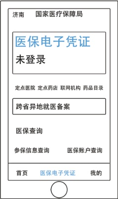
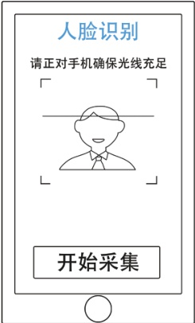
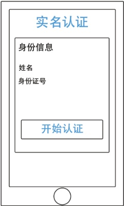
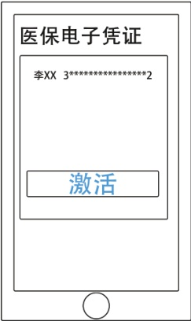

## 流程如下

## 方法一：国家医保APP 

医保电子凭证激活流程：

> 📌 图片内容识别：
>
> 济南国家医疗保障局
>
> 未登录
>
> 定点医院定点药店联网机构药品目录
>
> 跨省异地就医备案
>
> 医保查询
>
> 参保信息查询医保账户查询
>
> 首页医保电子凭证我的

1.点击医保电子凭证开始实人、实名认证

> 📌 图片内容识别：
>
> 

3.授权进行人脸识别认证

> 📌 图片内容识别：
>
> # 实名认证
>
> 身份信息
>
> 姓名
>
> 身份证号
>
> 开始认证

2.填写姓名、身份证号开始实名认证 

> 📌 图片内容识别：
>
> 

4.点击激活按钮

