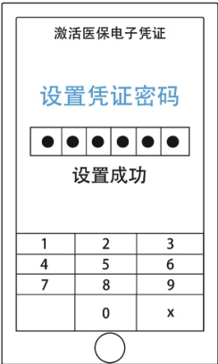
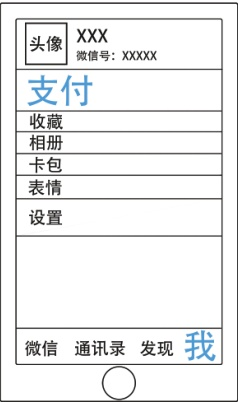

> 📌 图片内容识别：
>
> 

### 5. 设置凭证密码完成激活

## 方法二：微信

微信入口：

> 📌 图片内容识别：
>
> 
<html><body><table border="1"><tr><td>头像 XXX 微信号：XXXXX</td></tr><tr><td>支付</td></tr><tr><td>收藏</td></tr><tr><td>相册</td></tr><tr><td>卡包</td></tr><tr><td>表情</td></tr><tr><td>设置</td></tr><tr><td></td></tr><tr><td>我 微信 通讯录 发现</td></tr><tr><td></td></tr></table></body></html>

1.支付

<html><body><table border="1"><tr><td colspan="3">支付 收付款 钱包</td></tr><tr><td>XXXX</td><td>XXX</td><td>XXXX</td></tr><tr><td>XXX</td><td>XXXX</td><td>XXX</td></tr><tr><td>XX</td><td></td><td></td></tr><tr><td colspan="3">第三方服务</td></tr><tr><td colspan="3"></td></tr></table></body></html>

2.城市服务

