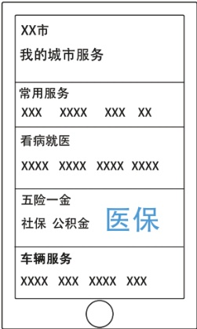
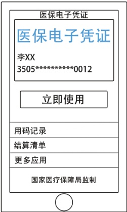
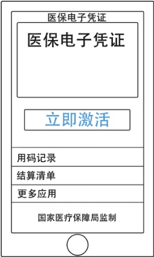
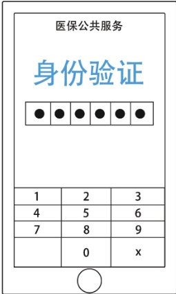

> 📌 图片内容识别：
>
> XX市
>
> 我的城市服务
>
> 常用服务
>
> XXX 
>
> XXXX 
>
> XXX 
>
> XX 
>
> 看病就医
>
> XXXX XXXX 
>
> XXXXXXXX 
>
> 五险一金
>
> 社保公积金
>
> 医保
>
> 车辆服务
>
> XXXX XXX 
>
> XXXX 
>
> XXX

3.医保

> 📌 图片内容识别：
>
> ## 医保电子凭证
>
> 医保电子凭证
>
> 李XX 
>
> 3505**********0012
>
> 立即使用
>
> 用码记录
>
> 结算清单
>
> 更多应用
>
> 国家医疗保障局监制
>
> 

4.医保电子凭证

## 激活步骤：

> 📌 图片内容识别：
>
> 

1.立即激活

> 📌 图片内容识别：
>
> 

2.身份验证

