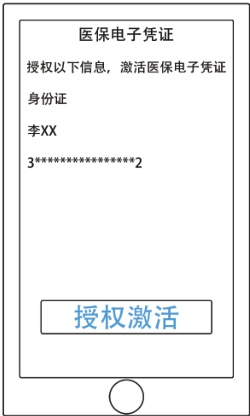
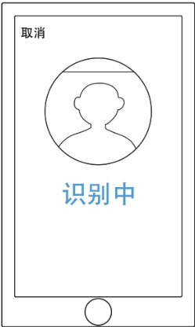
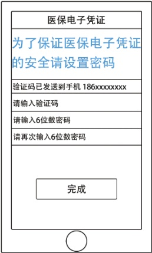
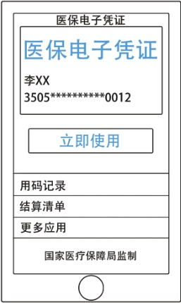

> 📌 图片内容识别：
>
> 

### 3. 授权激活

> 📌 图片内容识别：
>
> 取消
>
> 识别中

4.人脸识别

> 📌 图片内容识别：
>
> 

5.设置密码

> 📌 图片内容识别：
>
> ## 医保电子凭证
>
> 医保电子凭证
>
> 李XX 
>
> 350*5**********12
>
> 立即使用
>
> 用码记录
>
> 结算清单
>
> 更多应用
>
> 国家医疗保障局监制
>
> 

6.激活成功

