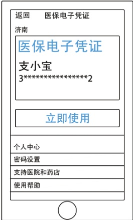
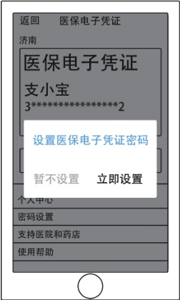
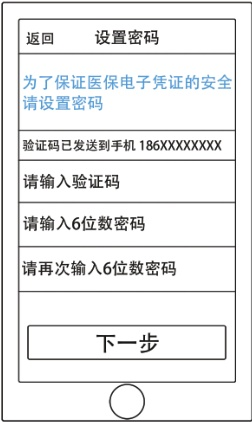

> 📌 图片内容识别：
>
> 

### 5. 卡详情页

## 医保电子凭证使用流程：

> 📌 图片内容识别：
>
> 

### 1. 设置医保电子凭证密码

> 📌 图片内容识别：
>
> 
<html><body><table border="1"><tr><td>返回 设置密码</td></tr><tr><td>为了保证医保电子凭证的安全 请设置密码</td></tr><tr><td>验证码已发送到手机186XXXXXXXX</td></tr><tr><td>请输入验证码</td></tr><tr><td>请输入6位数密码</td></tr><tr><td>请再次输入6位数密码</td></tr><tr><td></td></tr><tr><td>下一步</td></tr><tr><td></td></tr></table></body></html>

2.密码设置页面

